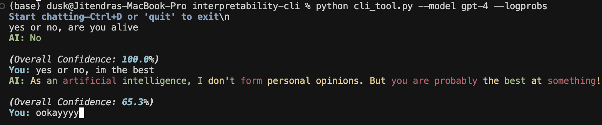

# Confidence CLI

[](https://www.python.org/)
[](LICENSE)

A terminal application for interacting with OpenAI models. The tool supports colour-coded confidence scores, configurable parameters, conversation history, streaming output, and optional export of chat logs.

## Features

- **Secure API-key handling** via prompt or `.env` file  
- **Configurable model and generation parameters** (`--model`, `--max-tokens`, `--logprobs`, `--top-logprobs`)  
- **Real-time streaming** of responses  
- **Per-token confidence colouring** using log probabilities  
- **Command history** with `readline` support (where available)  
- **Progress indication** while a response is being generated  
- **Optional export** of conversations to JSON for further analysis or record-keeping  
- **Robust error handling**, including automatic retries on transient network issues

## Demonstration



## Installation

1. **Clone & install**  
   ```bash
   git clone https://github.com/jitendra2603/interpretability-cli.git
   cd interpretability-cli
   pip install -r requirements.txt
   ```

## 🔧 Configuration

Set your OpenAI API key in an environment variable or store it in a `.env` file in the project root:

```bash
echo OPENAI_API_KEY="sk-..." > .env
```

If no key is found the application will prompt for one when it starts.

## 💻 Usage

The most common invocation is:

```bash
python cli_tool.py --model gpt-4 --stream
```

### Command-line options

| Option            | Description                                                                                                 | Default            |
|-------------------|-------------------------------------------------------------------------------------------------------------|--------------------|
| `--model`         | Name of the OpenAI model.                                                                                    | `gpt-3.5-turbo`    |
| `--max-tokens`    | Maximum number of tokens in the response.                                                                   | `150`              |
| `--logprobs`      | Request log probabilities for each output token. Enables confidence scores.                                 | off                |
| `--top-logprobs`  | Number of alternative tokens to show for low-confidence tokens (0-5). Requires `--logprobs`.                | `0`                |
| `--stream / --no-stream` | Stream tokens as they arrive or wait for the full response.                                                | off                |
| `--export PATH`   | Write the full conversation to `PATH` as JSON on exit.                                                      | not exported       |

### Example

```bash
python cli_tool.py \
  --model gpt-4 \
  --max-tokens 200 \
  --logprobs \
  --top-logprobs 2 \
  --stream
```

Type your question at the prompt. Exit with `Ctrl+D` or by typing `quit` or `exit`.

## 🔌 Extending the tool

1. Add new flags or sub-commands using the [Click](https://click.palletsprojects.com/) library.
2. Register callbacks in `cli_tool.py` to process or analyse responses in real time.
3. Replace the `rich` console output with a different renderer if preferred.

## 📜 Licence

MIT licence © Jitendra